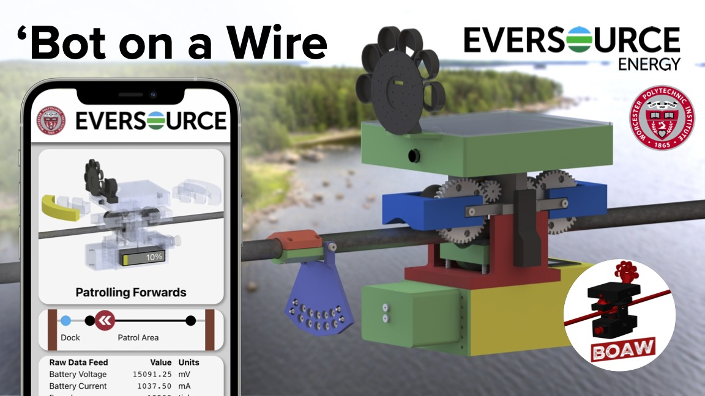
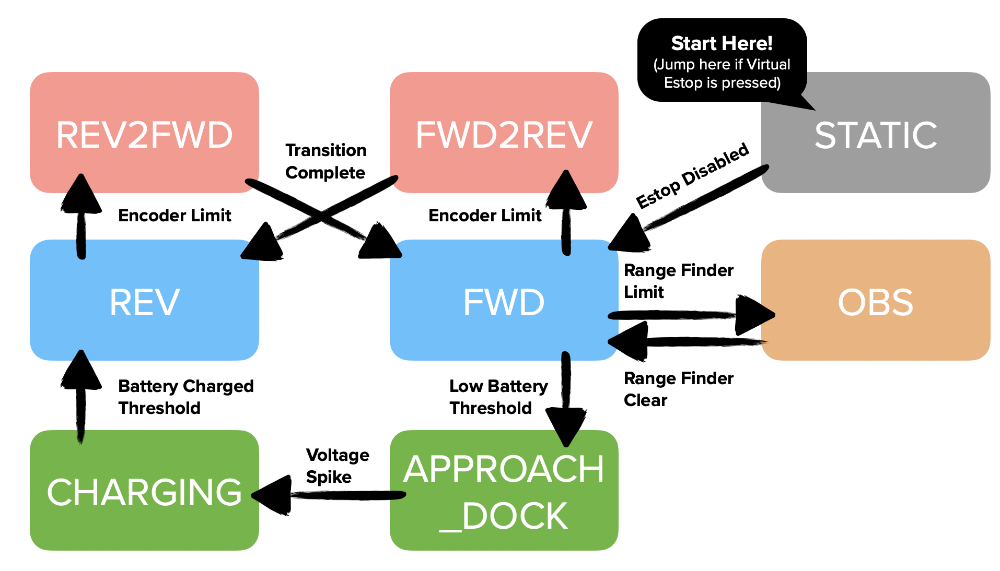
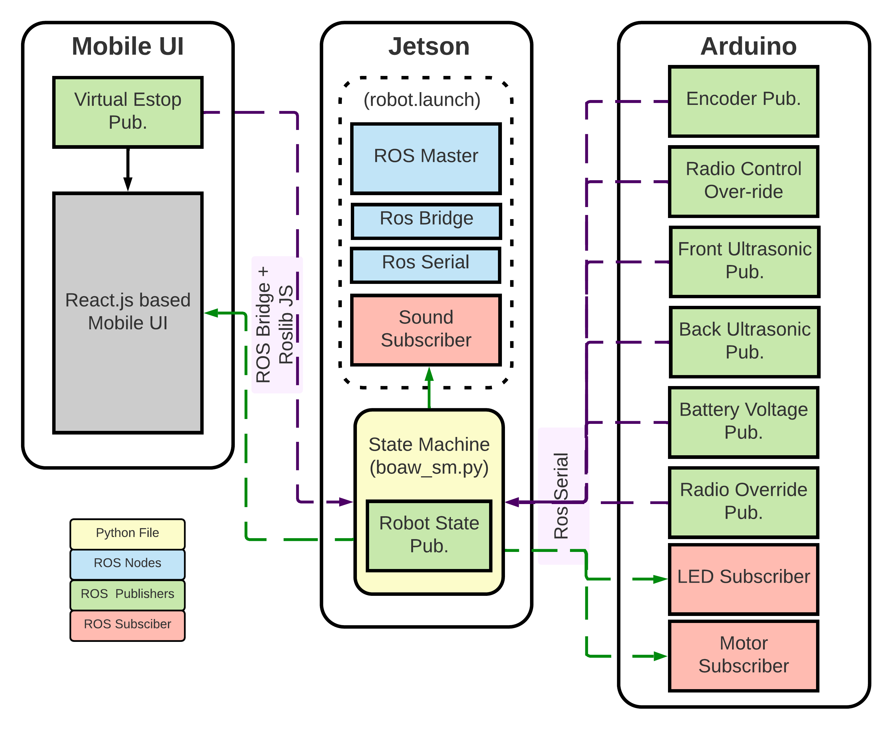
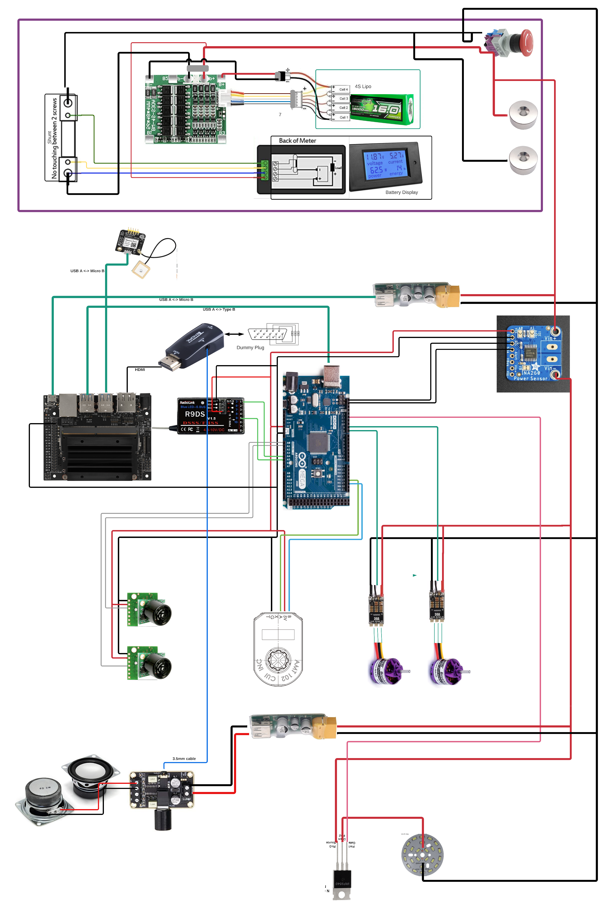

# WPIBOTONAWIRE-ROS


This repo contains all the code that was run on the Jetson side of the robot. There are several components:
- **boaw_sm.py:** the state machine that uses data published by other ROS nodes to control the high level function of the robot
- **robot.launch:** launch file to start up all the nodes needed on the Jetson 
- **arduino-com/:** contains a copy of the ros-serial node for communication with the arduino
- **gps/:** the node to interface with the GPS sensor + an untested kalman filter to combine the GPS and encoder data
- **server/:** unused code for Jetson to host a webserver for a web UI client to connect to
- **sound/:** node to pay a sine wave at any frequency on the default auduio device of the jetson
- **web/:** unused, ask Arthur

# Instalation / Setup

Developed and tested with:
- Jetson Nano 4GB
    - Ubuntu 20.04
    - Ros Noetic

Depends on:
- [WPIBotOnAWire/WPIBotOnAWire-Arduino](https://github.com/WPIBotOnAWire/WPIBotOnAWire-Arduino) (Running on a arduino connected to the Jetson via a USB port)
- (Optionally)[WPIBotOnAWire/WPIBotOnAWire-MobileUI](https://github.com/WPIBotOnAWire/WPIBotOnAWire-MobileUI) (Running on a computer on the same network as the Jetson)

## Step by step startup instructions:

### Wifi Setup and static IP
1. Power on the Jetson and plug a keyboard and plug it into a monitor through the DP port.
2. Log in to the Jetson with the credentials provided in the slack #pi_ip channel.
3. (If on the WPI network), using netreg.wpi.edu and register the Wi-Fi adapter mac address. Note the hostname (ex. http://jetson1-botonawire.dyn.wpi.edu/)
4. (If on a standard network), change network settings to that the Jetson has a static IP so that it doesn't change every time the jetson restarts. Note the static IP
5. Make sure the wifi settings in Ubuntu are correct so that the Jetson connects to the correct network automatically on startup
6. Restart the jetson and ensure that the network connection is established without any user input.
7. You can test the connection by running `ping (staticIP)` ex: ping `jetson1-botonawire.dyn.wpi.edu` from a terminal on a computer on the same network as the Jetson

### Connecting and Install

1. Power on the Jetson without a keybaord or display.
2. Open up a terminal from a laptop **on the same network as the Jetson** and run the command `ssh (ubuntu username)@(static IP or hostname)`. For example: `ssh botonawire@jetson1-botonawire.dyn.wpi.edu`
3. Enter the password you used to log into the Jetson.
#### You can skip the rest of this section if you are using the Jetson we already setup.
4. Make sure [ROS noetic](http://wiki.ros.org/noetic/Installation/Ubuntu) and all dependencies are installed (using rosdep is recommended but manually with sudo apt-get is ok too.
5. Clone this directory into your catkin_ws/src folder (this file should be at ~/catkin_ws/src/WPIBotOnAWire/README.md)
6. Don't forget to `catkin_make` and source all the files!

### Run all programs (do this each time you power on)
1. Run `cd ~/catkin_ws/src/WPIBotOnAWire/`
2. Run `roslaunch robot.launch`
3. Open another terminal window or tab and connect to the Jetson again with: `ssh (ubuntu username)@(static IP or hostname)`
4. Run `cd ~/catkin_ws/src/WPIBotOnAWire/`
5. Run `python boaw_sm.py`

# Troubleshooting
- Launch file gives rosserial connection errors
    - Make sure the Arduino is plugged in and the light is on
    - Edit this line in the launch file and plug in the correct USB port: ` <param name="port" value="/dev/ttyACM1"/>` usually this is between ttyAMC1 or ttyAMC0
- Web UI not connecting
    - Make sure both devices are on the same network
    - Make sure you can ping the Jetson from the webUI server
    - Make sure the IP and port is correct on the mobile UI code. Url should be the static IP of the Jetson and the port should match the rosbrige launch file port parameter (defaults to 9090)
    ```  
    window.ros = new ROSLIB.Ros({
      url : 'ws://172.20.10.10:9090'
    }); 

    (from WPIBotOnAWire-MobileUI/public/index.html)
    ```
- Rangefinder gives very small or very large numbers only
    - Make sure all electrical connections are correct
    - Make sure the Jetson and Arduino share a common ground. This is done by jumping the grounds from each board to the other one.

# State Machine

(This is the state machine inside of boaw_sm.py. It is based on [smach](https://www.google.com/search?client=safari&rls=en&q=smach&ie=UTF-8&oe=UTF-8).)

# Rostopics

| Topic Name     | Data Type | Origin | Description |
| ----------- | ----------- | -- | -- |
| /play_sound   | std_msgs/Int32        | /sound/src/play.py | Plays a sound on the Jetson's default audio device with the given frequency for 1 second. Publishing 4000 will play a 4kHz sine wave for 1000ms|
| /deterrents/led   | std_msgs/Bool        |Arduino (via [Ros-Serial](http://wiki.ros.org/rosserial)) | Publish true to turn on the deterrent LED, false for off.|
| /motor_speed   | std_msgs/Float32        |Arduino (via [Ros-Serial](http://wiki.ros.org/rosserial)) | Publish a number between -1 to 1 where -1 is full backwards, and 1 is full forwards. ESCs take a range between 1000 - 2000 but the conversion is done in the arduino.
| /rangefinder/front   | std_msgs/Float32        |Arduino (via [Ros-Serial](http://wiki.ros.org/rosserial)) | Subscribe to get a distance in inches for the front ultrasonic. 
| /rangefinder/back   | std_msgs/Float32        |Arduino (via [Ros-Serial](http://wiki.ros.org/rosserial)) | Subscribe to get a distance in inches for the back ultrasonic. 
| /battery   | [sensor_msgs/BatteryState](https://docs.ros.org/en/melodic/api/sensor_msgs/html/msg/BatteryState.html) | Arduino (via [Ros-Serial](http://wiki.ros.org/rosserial)) |Subscribe to get a battery state message from the battery monitoring chip. Only provides values for voltage (mV) and current (mA).|
| /encoder   | std_msgs/Float32        |Arduino (via [Ros-Serial](http://wiki.ros.org/rosserial)) | Subscribe to get a the number of ticks on the encoder. This value only reset when the Arduino looses power.|
| /switch   | std_msgs/Bool        |From WebUI (via [Rosbridge](http://wiki.ros.org/rosbridge_suite))| Subscribe to get the state of the Web UI Estop button. True when EStop is ON.
| /robot_state   | std_msgs/String        |Mainly from boaw_sm.py| Subscribe to get a human friendly version of the robot state. This is the state text shown in the mobile UI.
| /manual_override | std_msgs/Bool | Arduino (via [Ros-Serial](http://wiki.ros.org/rosserial)) | Subscribe to get the handheld radio manual override switch state. True means the override is engaged and the robot is under manual control.
| Other [Rosbridge](http://wiki.ros.org/rosbridge_suite) Topics   | various       |Launch file rosbridge_server  | Unused, but could be used to see if the Mobile UI is still connected. 

# Hardware

### Hardware Troubleshooting (TODO More Explanation)
- Is the BMS board not providing any voltage even though the battery is plugged in and is charged? Make sure to activate the BMS board by connecting a power supply to the magnetic charging connectors to 'active' it. More explanation on the Amazon reviews for the product page.
- If the BMS provides a weird voltage like 2S (8V )or 3S (12V), make sure to check the inputs of the BMS to make sure all cells are balanced. 
- PLA gears on the drive train are starting to chip due to manual driving of the robot for fun. Reprint more from teh GrabCAD or consider CNC milling some spur gears.
- The Center of mass of the robot is still too high. Add a weight at the bottom or reduce the weight from the top. We did this in Demo 4 by strapping a dumbbell to the bottom. 


# Weird things that could be fixed
- Refresh rate for Arduino publishers increases when radio override is toggled for some reason.
- Encoder topic should be switched since it returns whole number ticks only.
- The current battery capacity is measured through voltage only. There are better ways to do this that should be further explored. [Article here](https://www.scienceabc.com/innovation/what-are-the-different-methods-to-estimate-the-state-of-charge-of-batteries.html)
